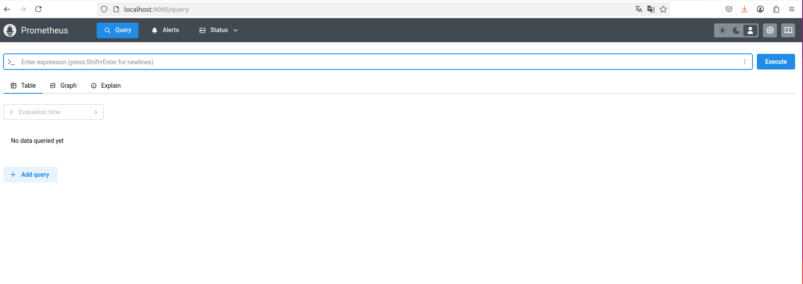
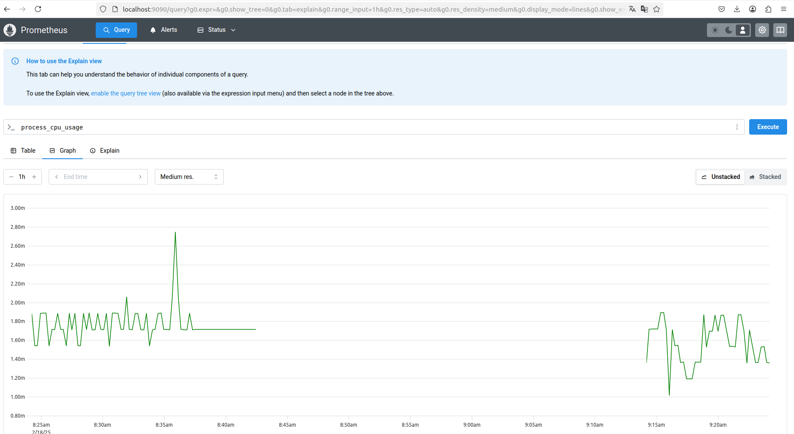

## Задание 10:
Добавить в простое CRUD веб-приложение, которое было разработано на семинаре функцию удаления данных о пользователе:
1) В класс UserRepository добавить метод public void deleteById(int id)(подсказка: SQL запрос "DELETE FROM userTable WHERE id=?", метод jdbc.update) - удаления записи пользователя из БД по ID.
2) В класс UserService добавить метод public void deleteById(int id)(подсказка: в нем вызывается метод userRepository.deleteById) - удаление пользователя через репозиторий.
3) В класс UserController добавить метод public String deleteUser(@PathVariable("id") int id)(с аннотацией: @GetMapping("user-delete/{id}")) (подсказка: в нем вызывается метод userService.deleteById) - перехват команды на удаление студента от браузера.

Если задание выполнено верно, то при запуске приложения по адресу http://localhost:8080/users будет работать кнопка удаления пользователя по ID.

## Задание 11
1) Подключить к своему проекту зависимости actuator, registry-prometheus и micrometer.
2) Установить и подключить к проекту prometheus
3) Установить и подключить Grafana. В Grafana добавить пару точеу контроля( Например: процессоное время приложения и количество запросов)

